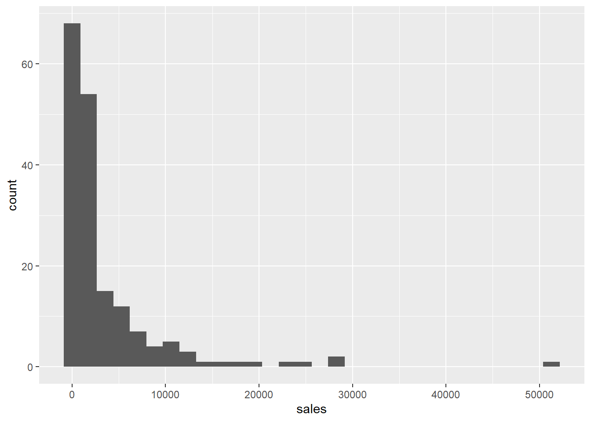
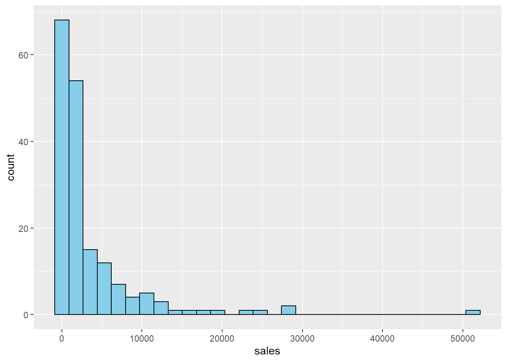
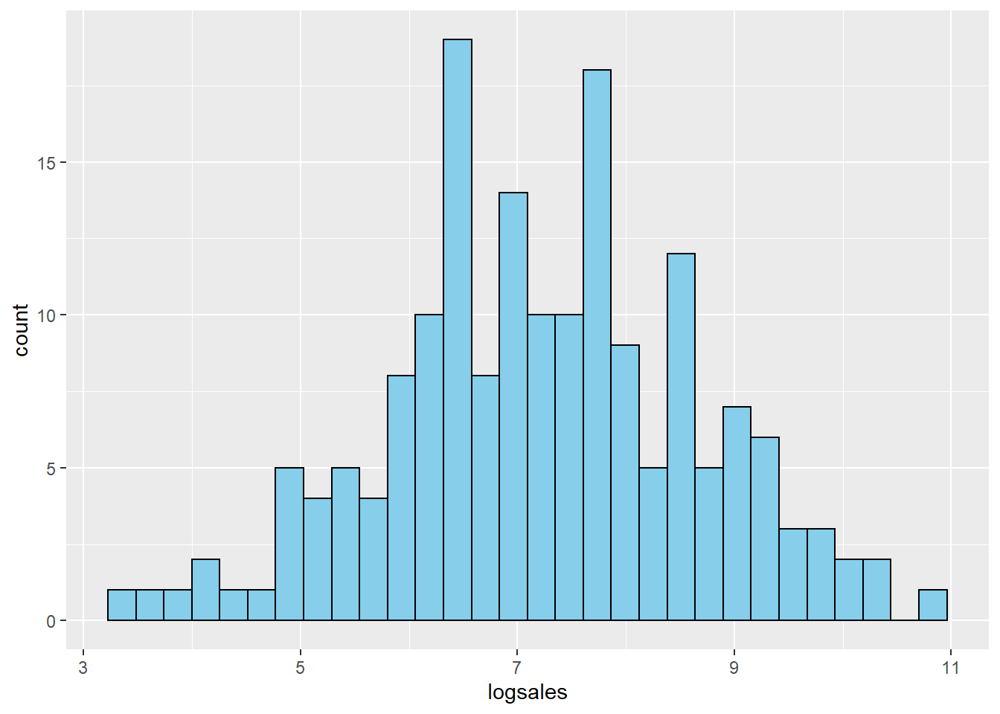
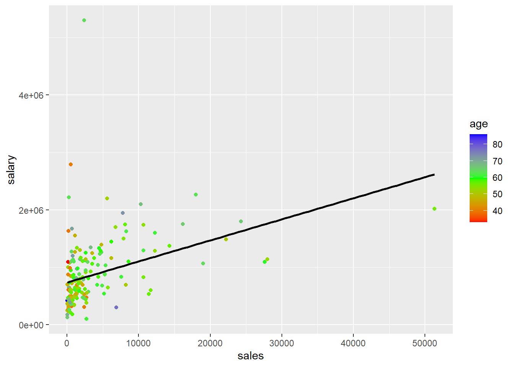
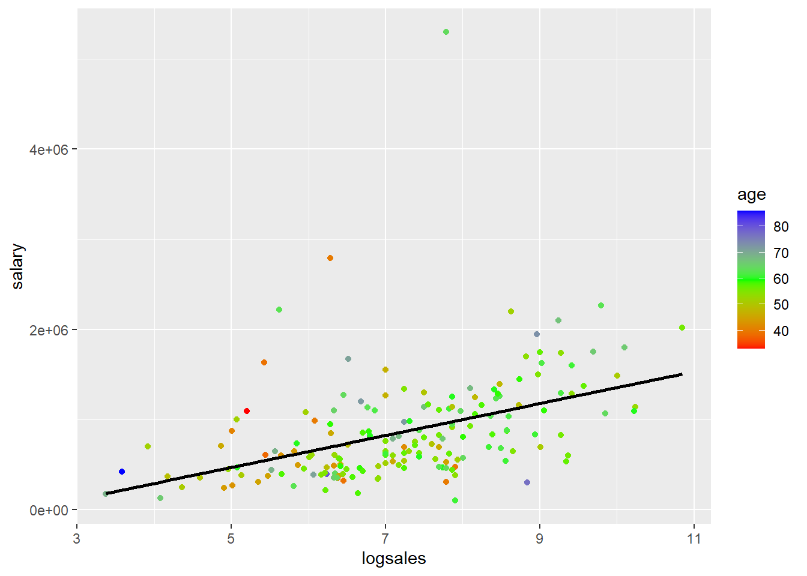
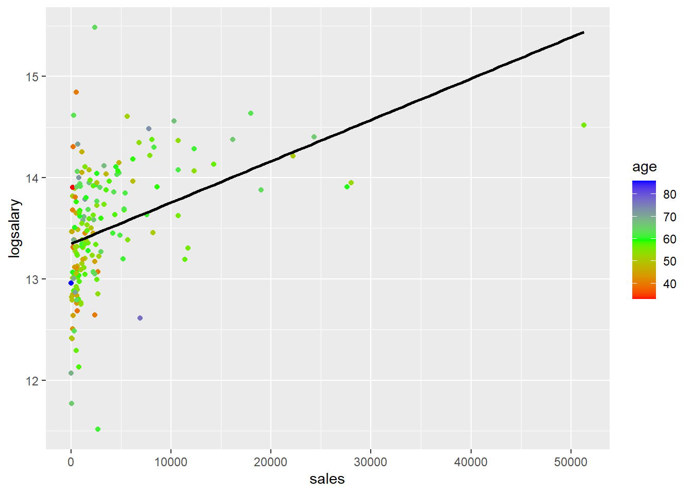
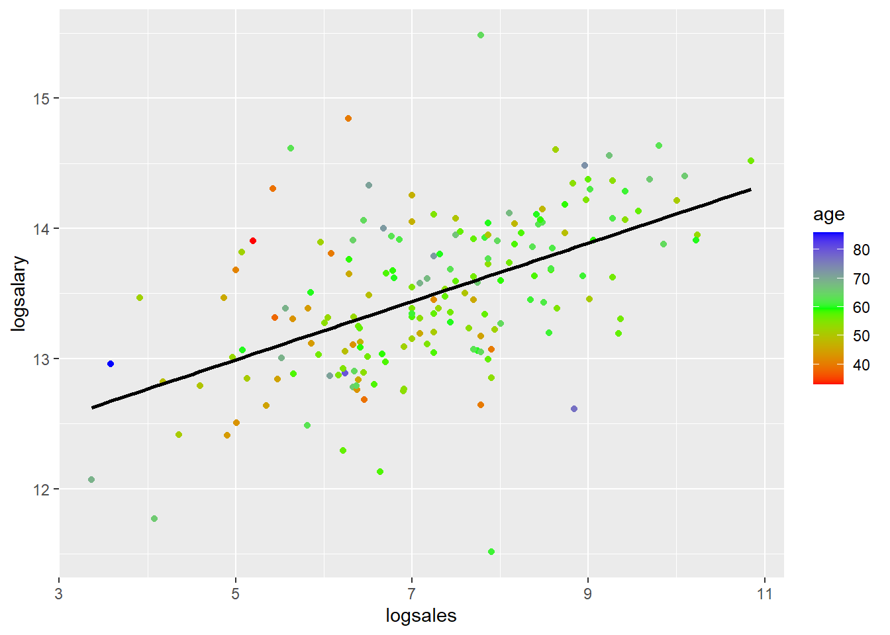

# Regression Output Table Examples

#I AM MAKING A CHANGE-YILDIZ ALTIN!

This RMD file was one of the examples you worked through in 380. I'm including it in this example for a few reasons. First, you can see how RMD files that you used before as standalone RMD files to create standalone HTML output can be combined in a book using bookdown. Second, this file loads data using `read.csv("data/ceo.csv")`, serving as an example of how you will store all data in a "data" folder put in the main project folder. Third, this file provides examples of showing regression output side by side. 


Note: Generally it's a good idea to load your packages in a code chunk at the top rather than mixed in with the rest of the document. However, for this example I am going to load the packages  in the same code chunk where I use them so that you can see exactly what package is needed for specific functions.


The dataset `ceo.csv` has the following variables:
  
  Variable | Description
----------- | -----------
`salary` | 1990 compensation in dollars ($)
`age` | age of CEO in years
`comten` | years CEO with company
`ceoten` | years as ceo with company
`sales` | 1990 firm sales in $millions
`profits` | 1990 profits in $millions
`mktval` | 1990 market value in $millions

## Summary Statistics
The `stargazer` package provides an easy way to display summary statistics. You need the `result='asis'` codechunk option so that it displays the html table in the knit output file. The `warning=FALSE` and `message=FALSE` keeps it from displaying some of the messages it displays by default. One limitation of the table output is that it doesn't leave much space horizontally. This can be controlled by HTML options for cell padding in tables. 


```r
library(stargazer)
mydata <- read.csv("data/ceo.csv")
stargazer(mydata, type = "html",summary.stat = c("n","mean","sd", "min", "median", "max"))
```


<table style="text-align:center"><tr><td colspan="7" style="border-bottom: 1px solid black"></td></tr><tr><td style="text-align:left">Statistic</td><td>N</td><td>Mean</td><td>St. Dev.</td><td>Min</td><td>Median</td><td>Max</td></tr>
<tr><td colspan="7" style="border-bottom: 1px solid black"></td></tr><tr><td style="text-align:left">salary</td><td>177</td><td>865,864.400</td><td>587,589.300</td><td>100,000</td><td>707,000</td><td>5,299,000</td></tr>
<tr><td style="text-align:left">age</td><td>177</td><td>56.429</td><td>8.422</td><td>33</td><td>57</td><td>86</td></tr>
<tr><td style="text-align:left">comten</td><td>177</td><td>22.503</td><td>12.295</td><td>2</td><td>23</td><td>58</td></tr>
<tr><td style="text-align:left">ceoten</td><td>177</td><td>7.955</td><td>7.151</td><td>0</td><td>6</td><td>37</td></tr>
<tr><td style="text-align:left">sales</td><td>177</td><td>3,529.463</td><td>6,088.654</td><td>29</td><td>1,400</td><td>51,300</td></tr>
<tr><td style="text-align:left">profits</td><td>177</td><td>207.831</td><td>404.454</td><td>-463</td><td>63</td><td>2,700</td></tr>
<tr><td style="text-align:left">mktval</td><td>177</td><td>3,600.316</td><td>6,442.276</td><td>387</td><td>1,200</td><td>45,400</td></tr>
<tr><td colspan="7" style="border-bottom: 1px solid black"></td></tr></table>


## Model comparisons

Consider four models:


```r
model1 <- lm(salary~sales+mktval+profits,data=mydata)
model2 <- lm(salary~sales+mktval+profits+age,data=mydata)
model3 <- lm(salary~sales+mktval+profits+ceoten,data=mydata)
model4 <- lm(salary~sales+mktval+profits+ceoten+age,data=mydata)
```


One package that allows you to report the results for all four models is the `stargazer` package. This produces a table similar to the `esttab` output in Stata. Remember that each column is a separate model and if a variable does not have a coefficient displayed in a column, that means it was not included as an explanatory variable in that model.


```r
stargazer(model1, model2, model3, model4, type = "html", report=('vc*p'))
```


<table style="text-align:center"><tr><td colspan="5" style="border-bottom: 1px solid black"></td></tr><tr><td style="text-align:left"></td><td colspan="4"><em>Dependent variable:</em></td></tr>
<tr><td></td><td colspan="4" style="border-bottom: 1px solid black"></td></tr>
<tr><td style="text-align:left"></td><td colspan="4">salary</td></tr>
<tr><td style="text-align:left"></td><td>(1)</td><td>(2)</td><td>(3)</td><td>(4)</td></tr>
<tr><td colspan="5" style="border-bottom: 1px solid black"></td></tr><tr><td style="text-align:left">sales</td><td>15.984</td><td>15.369</td><td>18.233<sup>*</sup></td><td>18.061</td></tr>
<tr><td style="text-align:left"></td><td>p = 0.152</td><td>p = 0.169</td><td>p = 0.100</td><td>p = 0.106</td></tr>
<tr><td style="text-align:left"></td><td></td><td></td><td></td><td></td></tr>
<tr><td style="text-align:left">mktval</td><td>23.831</td><td>23.842</td><td>21.157</td><td>21.231</td></tr>
<tr><td style="text-align:left"></td><td>p = 0.137</td><td>p = 0.137</td><td>p = 0.183</td><td>p = 0.183</td></tr>
<tr><td style="text-align:left"></td><td></td><td></td><td></td><td></td></tr>
<tr><td style="text-align:left">profits</td><td>31.703</td><td>28.100</td><td>48.636</td><td>47.528</td></tr>
<tr><td style="text-align:left"></td><td>p = 0.909</td><td>p = 0.920</td><td>p = 0.859</td><td>p = 0.863</td></tr>
<tr><td style="text-align:left"></td><td></td><td></td><td></td><td></td></tr>
<tr><td style="text-align:left">age</td><td></td><td>4,528.026</td><td></td><td>823.966</td></tr>
<tr><td style="text-align:left"></td><td></td><td>p = 0.353</td><td></td><td>p = 0.873</td></tr>
<tr><td style="text-align:left"></td><td></td><td></td><td></td><td></td></tr>
<tr><td style="text-align:left">ceoten</td><td></td><td></td><td>12,730.860<sup>**</sup></td><td>12,390.430<sup>**</sup></td></tr>
<tr><td style="text-align:left"></td><td></td><td></td><td>p = 0.026</td><td>p = 0.042</td></tr>
<tr><td style="text-align:left"></td><td></td><td></td><td></td><td></td></tr>
<tr><td style="text-align:left">Constant</td><td>717,062.400<sup>***</sup></td><td>464,424.700<sup>*</sup></td><td>613,958.800<sup>***</sup></td><td>570,743.300<sup>**</sup></td></tr>
<tr><td style="text-align:left"></td><td>p = 0.000</td><td>p = 0.093</td><td>p = 0.000</td><td>p = 0.042</td></tr>
<tr><td style="text-align:left"></td><td></td><td></td><td></td><td></td></tr>
<tr><td colspan="5" style="border-bottom: 1px solid black"></td></tr><tr><td style="text-align:left">Observations</td><td>177</td><td>177</td><td>177</td><td>177</td></tr>
<tr><td style="text-align:left">R<sup>2</sup></td><td>0.178</td><td>0.182</td><td>0.201</td><td>0.202</td></tr>
<tr><td style="text-align:left">Adjusted R<sup>2</sup></td><td>0.163</td><td>0.163</td><td>0.183</td><td>0.178</td></tr>
<tr><td style="text-align:left">Residual Std. Error</td><td>537,420.300 (df = 173)</td><td>537,621.100 (df = 172)</td><td>531,159.300 (df = 172)</td><td>532,670.100 (df = 171)</td></tr>
<tr><td style="text-align:left">F Statistic</td><td>12.464<sup>***</sup> (df = 3; 173)</td><td>9.559<sup>***</sup> (df = 4; 172)</td><td>10.846<sup>***</sup> (df = 4; 172)</td><td>8.633<sup>***</sup> (df = 5; 171)</td></tr>
<tr><td colspan="5" style="border-bottom: 1px solid black"></td></tr><tr><td style="text-align:left"><em>Note:</em></td><td colspan="4" style="text-align:right"><sup>*</sup>p<0.1; <sup>**</sup>p<0.05; <sup>***</sup>p<0.01</td></tr>
</table>


### Adjusted R-Squared

Recall the definition of $R^2$:
$$
R^2 = \frac{SSE}{SST} = 1 - \frac{SSR}{SST}
$$

The denominator measures the total variation in the $y$ variable: $SST = (n-1)Var(y)$. Thus, it has nothing to do with the explanatory variables. Adding additional $x$ variables does not affect $SST$. Adding an additional $x$ variable cannot decrease how much of the variation in $y$ explained by the model, so $SSE$ will not decrease. Usually it increases at least a little bit. Thus, adding an additional $x$ variable cannot decrease $R^2$, and it usually increases it at least a little bit. This means that $R^2$ increasing is a not a good justification for adding an additional $x$ variable to the model.

Adjusted $R^2$, often denoted $\bar{R}^2$, penalizes you for adding an additional $x$ variable. Adjusted $R^2$ only increases if the new variable has a sufficiently significant effect on $y$. Adjusted $R^2$ is defined as

$$
\bar{R}^2 = 1 - \frac{\left(\frac{SSR}{n-k-1}\right)}{\left(\frac{SST}{n-1}\right)}
$$

Look at the models above. All four models include measures of the company, including sales, market value, and profits. Models 2-4 add variables measuring characteristics of the CEO. Compare models 1 and 2. Adding the CEOs age increases $R^2$ but adjusted $R^2$ does not increase, indicating that adding age does not improve the model. Comparing models 1 and 3, both $R^2$ and adjusted $R^2$ increase when adding the CEO's tenure, indicating this variable does improve the model. Comparing models 3 and 4, we again see that adding the CEO's age does not improve the model; $R^2$ increases slightly but adjusted $R^2$ goes down.


## Test Linear Combinations of Parameters

Consider again Model 3. I'll display the estimates again here to demonstrate using the `kable()` from `knitr` and `broom`)


```r
library(knitr)
library(broom)
model3 <- lm(salary~sales+mktval+profits+ceoten,data=mydata)
kable(tidy(model3),digits = 2)
```


|term        |  estimate| std.error| statistic| p.value|
|:-----------|---------:|---------:|---------:|-------:|
|(Intercept) | 613958.78|  65486.13|      9.38|    0.00|
|sales       |     18.23|     11.01|      1.66|    0.10|
|mktval      |     21.16|     15.79|      1.34|    0.18|
|profits     |     48.64|    273.37|      0.18|    0.86|
|ceoten      |  12730.86|   5635.96|      2.26|    0.03|


It looks like the coefficient on profits (48.636087) is larger than the coefficient on sales, but is this difference statistically significant? The test statistic is


$$
t=\frac{\left(\hat{\beta}_{profit}-\hat{\beta}_{sales}\right)-0}{se\left(\hat{\beta}_{profit}-\hat{\beta}_{sales}\right)}
$$

In R, this test can be implemented using the `glht()` function from the `multcomp` package:


```r
library(multcomp)
##We need to know the "names" so we can reference them
names(coef(model3))
```

```
## [1] "(Intercept)" "sales"       "mktval"      "profits"     "ceoten"
```

```r
testOfDif <- glht(model3, linfct = c("profits - sales = 0"))
summary(testOfDif)
```

```
## 
## 	 Simultaneous Tests for General Linear Hypotheses
## 
## Fit: lm(formula = salary ~ sales + mktval + profits + ceoten, data = mydata)
## 
## Linear Hypotheses:
##                      Estimate Std. Error t value Pr(>|t|)
## profits - sales == 0     30.4      278.0   0.109    0.913
## (Adjusted p values reported -- single-step method)
```

```r
confint(testOfDif)
```

```
## 
## 	 Simultaneous Confidence Intervals
## 
## Fit: lm(formula = salary ~ sales + mktval + profits + ceoten, data = mydata)
## 
## Quantile = 1.9739
## 95% family-wise confidence level
##  
## 
## Linear Hypotheses:
##                      Estimate  lwr       upr      
## profits - sales == 0   30.4026 -518.2618  579.0671
```


What about `ceoten` compared to `sales`?


```r
testOfDif2 <- glht(model3, linfct = c("ceoten - sales = 0"))
summary(testOfDif2)
```

```
## 
## 	 Simultaneous Tests for General Linear Hypotheses
## 
## Fit: lm(formula = salary ~ sales + mktval + profits + ceoten, data = mydata)
## 
## Linear Hypotheses:
##                     Estimate Std. Error t value Pr(>|t|)  
## ceoten - sales == 0    12713       5635   2.256   0.0253 *
## ---
## Signif. codes:  0 '***' 0.001 '**' 0.01 '*' 0.05 '.' 0.1 ' ' 1
## (Adjusted p values reported -- single-step method)
```

```r
confint(testOfDif2)
```

```
## 
## 	 Simultaneous Confidence Intervals
## 
## Fit: lm(formula = salary ~ sales + mktval + profits + ceoten, data = mydata)
## 
## Quantile = 1.9739
## 95% family-wise confidence level
##  
## 
## Linear Hypotheses:
##                     Estimate   lwr        upr       
## ceoten - sales == 0 12712.6292  1590.0204 23835.2380
```


## Log transformations

This data provides a good example of why visualizing the data can be helpful. By looking at histograms and scatter plots, you can see the effects of log transformations. .

### Histograms

Try making histograms of `salary` and `log(salary)`


Try making histograms of `sales` and `log(sales)`


First, here is a histogram of sales.


```r
library(ggplot2)
ggplot(mydata,aes(x=sales)) + geom_histogram()
```

```
## `stat_bin()` using `bins = 30`. Pick better value with `binwidth`.
```




```r
library(ggplot2)
ggplot(mydata,aes(x=sales)) + geom_histogram(fill="skyblue", color="black")
```

```
## `stat_bin()` using `bins = 30`. Pick better value with `binwidth`.
```



This distribution is very skewed. Here is the histogram of $log(sales)$


```r
mydata$logsales <- log(mydata$sales)
ggplot(mydata,aes(x=logsales)) + geom_histogram(fill="skyblue", color="black")
```

```
## `stat_bin()` using `bins = 30`. Pick better value with `binwidth`.
```




We notice a similar pattern with salary.


```r
ggplot(mydata,aes(x=sales)) + geom_histogram(fill="skyblue", color="black")
```

```
## `stat_bin()` using `bins = 30`. Pick better value with `binwidth`.
```


```r
mydata$logsalary <- log(mydata$salary)
ggplot(mydata,aes(x=logsales)) + geom_histogram(fill="skyblue", color="black")
```

```
## `stat_bin()` using `bins = 30`. Pick better value with `binwidth`.
```


### Scatter plots

You can also see how log transformations spreads out the data by looking at scatter plots of `salary` or `log(salary)` (y) versus `sales` or `log(sales)` corresponding with the four different models. I colored the points based on age just as an example. That has nothing to do with the log transformations.


```r
##plot(mydata$salary,mydata$sales)
ggplot(mydata,aes(y=salary,x=sales,col=age))+geom_point()+ scale_colour_gradientn(colours=rainbow(3)) + geom_smooth(method='lm',se=FALSE,col='black')
```

```
## `geom_smooth()` using formula 'y ~ x'
```




```r
##plot(mydata$salary,mydata$sales)
ggplot(mydata,aes(y=salary,x=logsales,col=age))+geom_point()+ scale_colour_gradientn(colours=rainbow(3)) + geom_smooth(method='lm',se=FALSE,col='black')
```

```
## `geom_smooth()` using formula 'y ~ x'
```




```r
##plot(mydata$salary,mydata$sales)
ggplot(mydata,aes(y=logsalary,x=sales,col=age))+geom_point()+ scale_colour_gradientn(colours=rainbow(3))+ geom_smooth(method='lm',se=FALSE,col='black')
```

```
## `geom_smooth()` using formula 'y ~ x'
```




```r
##plot(mydata$salary,mydata$sales)
ggplot(mydata,aes(y=logsalary,x=logsales,col=age))+geom_point()+ scale_colour_gradientn(colours=rainbow(3)) + geom_smooth(method='lm',se=FALSE,col='black')
```

```
## `geom_smooth()` using formula 'y ~ x'
```




```r
mydata$logsalary <- log(mydata$salary)
model4 <- lm(salary~sales+mktval+profits+ceoten+age,data=mydata)
model4loglevel <- lm(logsalary~sales+mktval+profits+ceoten+age,data=mydata)
model4levellog <- lm(salary~logsales+mktval+profits+ceoten+age,data=mydata)
model4loglog <- lm(logsalary~logsales+mktval+profits+ceoten+age,data=mydata)
```


```r
stargazer(model4, model4loglevel, model4levellog, model4loglog, type = "html", report=('vc*p'))
```


<table style="text-align:center"><tr><td colspan="5" style="border-bottom: 1px solid black"></td></tr><tr><td style="text-align:left"></td><td colspan="4"><em>Dependent variable:</em></td></tr>
<tr><td></td><td colspan="4" style="border-bottom: 1px solid black"></td></tr>
<tr><td style="text-align:left"></td><td>salary</td><td>logsalary</td><td>salary</td><td>logsalary</td></tr>
<tr><td style="text-align:left"></td><td>(1)</td><td>(2)</td><td>(3)</td><td>(4)</td></tr>
<tr><td colspan="5" style="border-bottom: 1px solid black"></td></tr><tr><td style="text-align:left">sales</td><td>18.061</td><td>0.00003<sup>**</sup></td><td></td><td></td></tr>
<tr><td style="text-align:left"></td><td>p = 0.106</td><td>p = 0.022</td><td></td><td></td></tr>
<tr><td style="text-align:left"></td><td></td><td></td><td></td><td></td></tr>
<tr><td style="text-align:left">logsales</td><td></td><td></td><td>126,644.400<sup>***</sup></td><td>0.200<sup>***</sup></td></tr>
<tr><td style="text-align:left"></td><td></td><td></td><td>p = 0.0004</td><td>p = 0.00000</td></tr>
<tr><td style="text-align:left"></td><td></td><td></td><td></td><td></td></tr>
<tr><td style="text-align:left">mktval</td><td>21.231</td><td>0.00002</td><td>19.547</td><td>0.00001</td></tr>
<tr><td style="text-align:left"></td><td>p = 0.183</td><td>p = 0.280</td><td>p = 0.205</td><td>p = 0.330</td></tr>
<tr><td style="text-align:left"></td><td></td><td></td><td></td><td></td></tr>
<tr><td style="text-align:left">profits</td><td>47.528</td><td>0.00002</td><td>23.633</td><td>-0.00003</td></tr>
<tr><td style="text-align:left"></td><td>p = 0.863</td><td>p = 0.932</td><td>p = 0.925</td><td>p = 0.894</td></tr>
<tr><td style="text-align:left"></td><td></td><td></td><td></td><td></td></tr>
<tr><td style="text-align:left">ceoten</td><td>12,390.430<sup>**</sup></td><td>0.011<sup>*</sup></td><td>13,284.340<sup>**</sup></td><td>0.013<sup>**</sup></td></tr>
<tr><td style="text-align:left"></td><td>p = 0.042</td><td>p = 0.066</td><td>p = 0.025</td><td>p = 0.025</td></tr>
<tr><td style="text-align:left"></td><td></td><td></td><td></td><td></td></tr>
<tr><td style="text-align:left">age</td><td>823.966</td><td>-0.001</td><td>-1,679.167</td><td>-0.005</td></tr>
<tr><td style="text-align:left"></td><td>p = 0.873</td><td>p = 0.880</td><td>p = 0.740</td><td>p = 0.332</td></tr>
<tr><td style="text-align:left"></td><td></td><td></td><td></td><td></td></tr>
<tr><td style="text-align:left">Constant</td><td>570,743.300<sup>**</sup></td><td>13.282<sup>***</sup></td><td>-136,111.300</td><td>12.171<sup>***</sup></td></tr>
<tr><td style="text-align:left"></td><td>p = 0.042</td><td>p = 0.000</td><td>p = 0.680</td><td>p = 0.000</td></tr>
<tr><td style="text-align:left"></td><td></td><td></td><td></td><td></td></tr>
<tr><td colspan="5" style="border-bottom: 1px solid black"></td></tr><tr><td style="text-align:left">Observations</td><td>177</td><td>177</td><td>177</td><td>177</td></tr>
<tr><td style="text-align:left">R<sup>2</sup></td><td>0.202</td><td>0.206</td><td>0.247</td><td>0.316</td></tr>
<tr><td style="text-align:left">Adjusted R<sup>2</sup></td><td>0.178</td><td>0.182</td><td>0.225</td><td>0.296</td></tr>
<tr><td style="text-align:left">Residual Std. Error (df = 171)</td><td>532,670.100</td><td>0.548</td><td>517,256.700</td><td>0.509</td></tr>
<tr><td style="text-align:left">F Statistic (df = 5; 171)</td><td>8.633<sup>***</sup></td><td>8.853<sup>***</sup></td><td>11.223<sup>***</sup></td><td>15.789<sup>***</sup></td></tr>
<tr><td colspan="5" style="border-bottom: 1px solid black"></td></tr><tr><td style="text-align:left"><em>Note:</em></td><td colspan="4" style="text-align:right"><sup>*</sup>p<0.1; <sup>**</sup>p<0.05; <sup>***</sup>p<0.01</td></tr>
</table>


```r
mydata$logsalary = log(mydata$salary)
model0 <- lm(salary~sales,data=mydata)
model0loglevel <- lm(logsalary~sales,data=mydata)
model0levellog <- lm(salary~logsales,data=mydata)
model0loglog <- lm(logsalary~logsales,data=mydata)
```


```r
stargazer(model0, model0loglevel, model0levellog, model0loglog, type = "html", report=('vc*p'))
```


<table style="text-align:center"><tr><td colspan="5" style="border-bottom: 1px solid black"></td></tr><tr><td style="text-align:left"></td><td colspan="4"><em>Dependent variable:</em></td></tr>
<tr><td></td><td colspan="4" style="border-bottom: 1px solid black"></td></tr>
<tr><td style="text-align:left"></td><td>salary</td><td>logsalary</td><td>salary</td><td>logsalary</td></tr>
<tr><td style="text-align:left"></td><td>(1)</td><td>(2)</td><td>(3)</td><td>(4)</td></tr>
<tr><td colspan="5" style="border-bottom: 1px solid black"></td></tr><tr><td style="text-align:left">sales</td><td>36.694<sup>***</sup></td><td>0.00004<sup>***</sup></td><td></td><td></td></tr>
<tr><td style="text-align:left"></td><td>p = 0.00000</td><td>p = 0.000</td><td></td><td></td></tr>
<tr><td style="text-align:left"></td><td></td><td></td><td></td><td></td></tr>
<tr><td style="text-align:left">logsales</td><td></td><td></td><td>177,149.100<sup>***</sup></td><td>0.224<sup>***</sup></td></tr>
<tr><td style="text-align:left"></td><td></td><td></td><td>p = 0.000</td><td>p = 0.000</td></tr>
<tr><td style="text-align:left"></td><td></td><td></td><td></td><td></td></tr>
<tr><td style="text-align:left">Constant</td><td>736,355.200<sup>***</sup></td><td>13.347<sup>***</sup></td><td>-415,105.000<sup>**</sup></td><td>11.869<sup>***</sup></td></tr>
<tr><td style="text-align:left"></td><td>p = 0.000</td><td>p = 0.000</td><td>p = 0.046</td><td>p = 0.000</td></tr>
<tr><td style="text-align:left"></td><td></td><td></td><td></td><td></td></tr>
<tr><td colspan="5" style="border-bottom: 1px solid black"></td></tr><tr><td style="text-align:left">Observations</td><td>177</td><td>177</td><td>177</td><td>177</td></tr>
<tr><td style="text-align:left">R<sup>2</sup></td><td>0.145</td><td>0.168</td><td>0.186</td><td>0.281</td></tr>
<tr><td style="text-align:left">Adjusted R<sup>2</sup></td><td>0.140</td><td>0.163</td><td>0.182</td><td>0.277</td></tr>
<tr><td style="text-align:left">Residual Std. Error (df = 175)</td><td>545,008.600</td><td>0.554</td><td>531,513.300</td><td>0.515</td></tr>
<tr><td style="text-align:left">F Statistic (df = 1; 175)</td><td>29.576<sup>***</sup></td><td>35.327<sup>***</sup></td><td>40.096<sup>***</sup></td><td>68.345<sup>***</sup></td></tr>
<tr><td colspan="5" style="border-bottom: 1px solid black"></td></tr><tr><td style="text-align:left"><em>Note:</em></td><td colspan="4" style="text-align:right"><sup>*</sup>p<0.1; <sup>**</sup>p<0.05; <sup>***</sup>p<0.01</td></tr>
</table>


